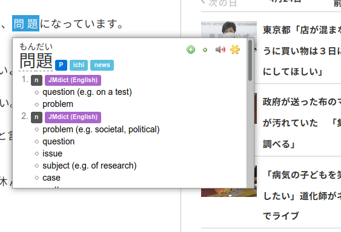

My friends know my interest in Japanese culture pretty well. These are my notes about my (first) **Journey to the** (languages of the) **East**.

## Prologue

I tried starting this journey multiple times in the past. I even went to a beginner class when I started university back in 2014 but I stopped going after a couple of weeks due to my lack of time at that point. The first time I really tried was about half a year ago. I got a copy of Genki and did about 5 lessons from it. Then I accidentally poured a glass of water into my workbook and stopped.

As you can see I'm not a total beginner but I'm certainly not too far from that. The book has approximately two pages of new words per chapter and a page contains ~30 words so my vocabulary is about 5\*2\*30 = 300 words. I also know the most basic sentence structure but my grammar is really close to 0 e.g. I totally forgot everything about conjugating verbs.

## Preparations

I am writing this to be usable from a total beginner point. I spent a lot of time searching the web for useful resources and learning methods. I hope my findings to be useful for those who happen to stumble upon this article even if they are just started to think about learning. My sources include mainly blog posts, polyglot YouTube channels and friends who know/study the language. I also skim through scientific articles occasionally.

> If you are generally interested in the art and science of learning I wholeheartedly recommend this MOOC:
> [https://www.coursera.org/learn/learning-how-to-learn](https://www.coursera.org/learn/learning-how-to-learn)  
> It can be easily done in about a week and provides some useful tips.

### Main points

I'm at the point where I have seen hours of (language) learning tip videos and read dozens of articles. These are the most important points I found out.
First, two general tips about studying:

  * **Thinking about something you have to do makes your brain feel bad.** This is why it's hard to start doing your homework for example. To put this into the context of language learning if you think about learning Japanese it seems to be an impossible task. **You should instead try to concentrate on the process of learning** e.g. sitting down and studying for 20-30 minutes at a time (pomodoro method). If you're anything like me after you start you'll start to enjoy the process more and more and you won't even want to stop.
  * **It doesn't matter what you study you should try to involve different types of stimuli/senses.** Pictures, sounds and metaphors/[mnemonics](https://en.wikipedia.org/wiki/Mnemonic) work well. [Memory palace](https://en.wikipedia.org/wiki/Method_of_loci) also seems to be an useful technique used by many memory experts (I am planning to practice it in the future).

Second, **the best way to acquire a language is by immersion**. This isn't a secret, the vast majority of polyglots will tell you this but it still goes against the classical picture of language learning in school. The thing is, the "classical images" we have come from a past where resource were vastly ulterior. The spread of the internet basically gave an infinite amount of information resources to everybody but we are still not used to it.

In fact the problem nowadays isn't the lack of information, it's **too much information.**

You can find thousands of videos and articles about most of the things you can think of. But most of this information is diluted to the level where consuming more of it without carefully choosing the sources after a small initial amount gives diminishing results. Tutorial hell is a very real thing and not at all just for programming. In fact one of the reasons I'm writing articles like this is organizing the stuff I collected and getting out of the perpetual "how to" video streams. After way too much tutorials I found out the best way to achieve mastery is always the hard way. That is, if you can walk on it... By this I mean you should always try to approach problems as smart as possible but there are no effortless ways in learning something so don't spend infinite time on optimizing your method.

> If you spend half an hour learning and only learn one simple thing you learned infinitely more than if you spend hours optimizing your method and learn nothing. And you still have time to optimize after that...

### Tools for the learning backpack

> Note: To actually be able to use the tools for learning Japanese you should firs learn to read and write. I'll explain how to do that later. You can use Anki without that though so I describe the tools first.

#### [Anki](https://apps.ankiweb.net/)

The plus ultra software for language learners and med students. Basically it is a program to quickly and effectively make and learn flashcards. The program by default isn't the best looking but as it is open source it is freely extensible and there are a lot of nice plugins for it. Also the cards are very flexible, they can contain text/images/audio/video/etc. You can read the documentation [here](https://docs.ankiweb.net/#/). If you just want a quickstart you can watch a tutorial (*haha*) on YouTube.

<iframe src="https://www.youtube.com/embed/5urUZUWoTLo" frameborder="0" allow="accelerometer; autoplay; encrypted-media; gyroscope; picture-in-picture" allowfullscreen></iframe>

I recommend putting a some time into learning the basics by watching the tutorial I linked on 1.5x speed and skimming through the docs and of course by experimenting. Also I recommend to install the newest version possible as there were pretty nice improvements and there is also a built in night mode now which needed a plugin earlier (it makes the interface much less painful to look at for me). I also recommend these plugins:
  * [MIA Japanese](https://ankiweb.net/shared/info/278530045) or the less bloated and more classic [Japanese support](https://ankiweb.net/shared/info/3918629684)
  * [Review heatmap](https://github.com/glutanimate/review-heatmap) from Glutanimate to be able to check how much and how consistently you study

#### [Yomichan](https://foosoft.net/projects/yomichan/index.html)

Previously an anki plugin now a browser extension this is one of my best finds for Japanese learning. It can search up words in dictionaries for you. It can also search recorded native audio for you for those words (if they exist of course). And it can export all of this into Anki cards, context included with the word if you want (I plan to write about why you *should* want it). It is easy to set up and use. The only problem I had with it until now is because the bad internet connection (since the corona outbreak) it sometimes doesn't download the audio for my Anki cards but then I simply delete and regenerate them.

> And actually with that I feel like I gave you enough to do for the worth of one article but <del>sadly with Japanese there is even more even just to begin</del> luckily with Japanese **there is always more to learn**.

### Some steps even before beginning

#### Learning kana

Japanese <del>are mad lads so they</del> have three separate writing systems *which they combine into one* so you need to learn all of them. Luckily two of them are not that hard to learn and after that you'll be able to write basically everything <del>just not correctly</del>.
Here is a two hour video explaining all of the basics you need. It's long because it explains everything nice and slowly and it is patched together from multiple videos so you can practice. You should repeat the sounds of the characters out loud while watching the video. 

<iframe width="560" height="315" src="https://www.youtube.com/embed/_wZHqOghvSs" frameborder="0" allow="accelerometer; autoplay; encrypted-media; gyroscope; picture-in-picture" allowfullscreen></iframe>

After you get the gist of it you can start drilling. For recognition practice [this deck](https://ankiweb.net/shared/info/576084877) looks pretty good (I used the deck it is built upon to learn kana) but there are a lot of shared kana decks so if you don't like it you can always pick another one. Also there are a ton of "learn kana" apps for smartphones. Most of them are garbage. I think repping Anki (what you *can* do on mobile) and writing on paper would be the best choice. You can find a ton of song lyrics converted to romaji you can practice writing that down with kana. If you have one of those smart things on which you can write with a pen or you just can't resist the convenience of using an app choose one that makes you write your kana and avoid multiple choice ones like Memrise and Duolingo.

#### Japanese input

You should read up on how to input Japanese to your PC/phone. It really isn't hard nowadays. I won't write about it in detail because it depends on what operating system you use so just google it.

## Conclusion

If you got to this part of the text you should at least know where to start. Learning kana can seem easy or hard at this point depending on how used are you to learning. If you find it hard I encourage you to not give up. With time it becomes much easier. As time passes learning will become more and more enjoyable as you will start to understand parts of the language. I recommend spending at least half an hour with your language studies every day. That much time won't make you progress fast but at least it's enough to progress slow.

> Tip: You can extend learning time by using Anki while you are on the bus/metro to school/work. If you for example spend as little as 2x15 minutes with commuting a day you can effectively double a "half an hour a day" schedule but it's 25% increase even if you study 2 hours.

The kana deck I linked has 244 cards. This includes literally *everything*. More than half of it are accented characters and compound characters which you'll be able to learn much faster. In reality you'll only need to learn ~2x46=92 unique characters. If you only learn 10 cards a day you'll still learn even the rarest compounds in a month. And you don't even need to know *everything* to start writing/practicing. After you know hiragana you're basically ready to go. But go and watch the video linked above instead of wasting your time reading vague motivational lines.

> **After all, every achievement distills down to simply being consistent with practice. Now get out there and train.**