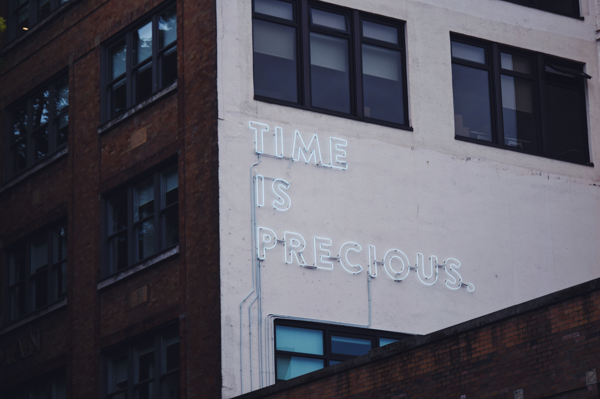

University students are mad. By university students I mean *those students*. Who aren't the geniuses. Heck, many times they aren't even near the top of the class. They struggle. They might break down mentally. Yet they still sit down to study. I idolize them in my mind. I envy their ability. It's such a simple thing I can't even write complex sentences about it. But it still seems impossibly hard to me. Oh, how much I want that ability.

At the start of this semester I felt like there's a chance. I just went back to my studies. A new age, new people, tabula rasa. I went to a research lab. I did not skip any classes. It was hard but thanks to a friend I was able to start building up some good habits. Then the virus hit and it all went to [insert rhyimg word here]. The first weeks were OK-ish. (WARNING: excuses incoming in 3 2 1 ...)

But, I came home... this makes living easier and much more safe of course. But there are two things at your home which make life so much harder when you want to change: A well known space and people who "know you". Both of these are things that induce habits. In my case these are the habits I worked so hard to weed out. I feel like the changes I was able to make in those one and a half months in my new environment were negated in mere weeks. I skipped classes, I procrastinated entire days I wanted to spend on my studies. I got to the point where I'm so profoundly behind schedule the simple thought of the amount I need to learn makes me scared and want to procrastinate more. I managed to build my little vicious cycle again. Still, I want to believe this time is different. I want to believe all those wasted hours were at least for a lesson.

At least I am more alert of what I'm doing and what I'm feeling than earlier. This isn't one of those self improvement stories so I won't give you a list of questionable self improvement tricks. I'm not entitled to and I don't want to. The only thing I know for a fact is that reading self improvement articles and watching self improvement videos does not work. Not because they are all bad but because they are all theoretical. Theories without implementation won't change anything. That's the thought I arrived at. It's the same as physical training. There are many good systems and methods which all work for different people. Trying one out is the only way to know if it works for you. Experimentation is the key. This is why I'm putting out this on my blog instead of writing it into my personal journal.

In the coming week I aim to introduce various changes into my daily life. The first one is one I tend to neglect: speaking people around me about the changes I want but struggle to achieve. I encourage you to do the same. Reading about mere plans is pretty uninteresting though, so I'll only share more with you when I have the actual data.

If you have any thoughts or tips in the topic please feel free to share with me.